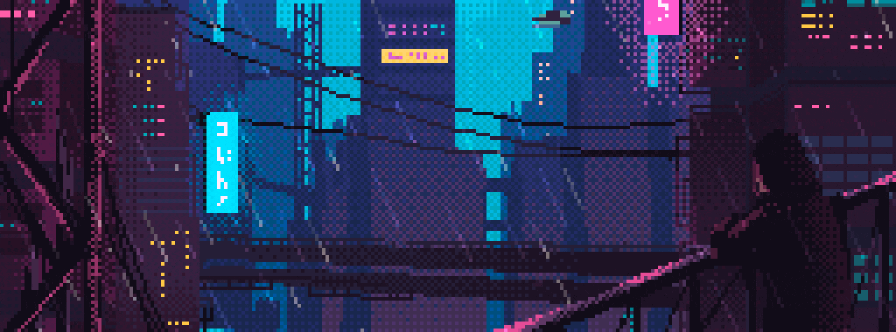

# Why hello there!

  <picture style="border-radius: .8rem;">
    <source 
      style="border-radius: .8rem;"
      srcset="assets/header/header.webp" 
      type="image/webp"
    /> 
    
  </picture>

 

 

  
    
  
   
    
  

